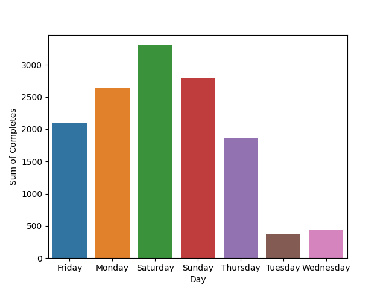

# Forecasting Demand for UberEats: Leveraging Historical Data to Optimize Delivery Service

## Table of Contents
- [Project Overview](#project-overview)
- [Forecasting Model](#forecasting-model)
- [Setup](#setup)

## Project Overview

The primary goal of this project is to leverage historical data on **UberEats deliveries** to develop a forecasting model that can predict future demand. By analyzing patterns and trends in the historical data, we aim to generate **accurate forecasts** for the number of delivery requests expected in the future.

The **dataset** used for this project contains information such as the date, hour, number of requests received, number of requests completed, number of hours drivers were on duty, number of hours drivers were on trip, predicted ETA, actual ETA, number of delivered products, and total products available. These variables provide valuable insights into the **demand patterns** and various factors influencing delivery services.

The dataset contains **comprehensive data** about UberEats deliveries over a period of one month, with distinct information for three different time periods each day: 11:00, 12:00 and 13:00.
Upon thorough analysis of the dataset, it has been determined that the time period with the **highest number** of deliveries is at `12:00`, indicating a peak in demand during that particular hour. This finding suggests that customers are more inclined to place UberEats orders around midday, possibly due to lunchtime preferences or convenience. 



Furthermore, the data reveals the days of the week with the highest delivery volumes in descending order. 
The analysis demonstrates that `Saturday` has the highest number of deliveries, followed by Sunday, Monday, Friday, Thursday, Wednesday, and Tuesday. This ranking provides valuable insights into the weekly **delivery patterns**, allowing businesses to allocate resources effectively and optimize their operations accordingly.

## Forecasting Model

For this project, three types of prediction models were used:

`Classifiers`

The classifier model was utilized to predict a **binary target variable**. The target variable indicates whether the **completion rate** of deliveries is higher than the average value. This model aims to categorize each delivery based on its completion rate, classifying it as either above average (1) or below average (0). The classifier model utilizes machine learning algorithms, including Support Vector Machine (SVM), Random Forest, Ada Boost, Decision Tree and Quadratic Discriminant Analysis.

`Linear Regression`

Linear regression was employed as a prediction model to estimate the **number of requests**. This model assumes a linear relationship between the independent variables (such as time, day, or other relevant factors) and the number of requests. By analyzing the historical UberEats delivery data, the linear regression model determines the coefficients that best fit the data, allowing for the prediction of the number of requests for future time periods.

`Recurrent Neural Network`

The RNN (Recurrent Neural Network) model was used to predict the number of requests. RNNs are a type of **neural network architecture** specifically designed for sequential data, making them well-suited for time series analysis. By leveraging the **temporal dependencies** and patterns in the UberEats delivery data, the RNN model can capture the time-based fluctuations and make predictions for future time periods. This model can consider the previous time periods' data and learn the long-term dependencies, enabling accurate forecasting of the number of requests.

## Setup

To set up the model, please follow the instructions below:

1. Clone the repository and set the directory 

```bash
git clone https://github.com/CescaNeri/UberDS.git && cd UberDS
```

2. Create and activate a virtual environment

```bash
python -m venv env
.\env\Scripts\activate
```

3. Install the required dependencies

```bash
pip install -r requirements.txt
```

4. Run the data_exploration.py script to gather insights about the dataset

```bash
python data_exploration.py
```

5. Run the prediction_model.py script to execute the models

```bash
python prediction_model.py
```

This script will train and execute the prediction model based on the chosen algorithm (classifier, linear regression, or RNN). It will utilize the prepared data to make predictions or generate forecasts, depending on the specific model implemented.


